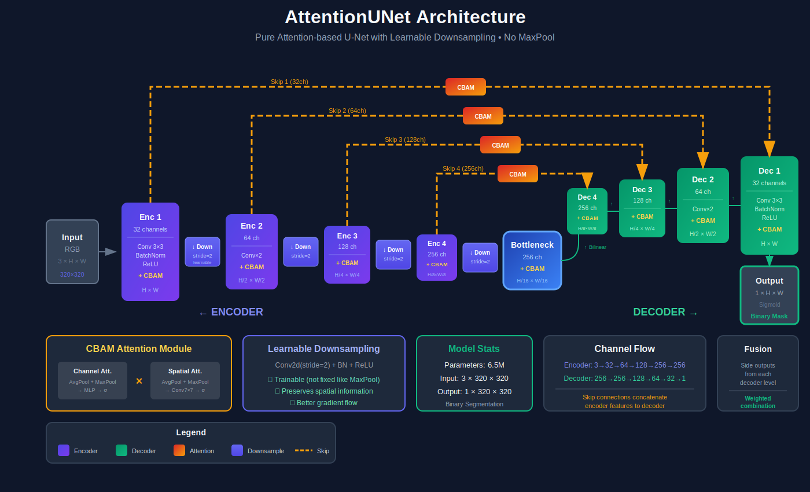
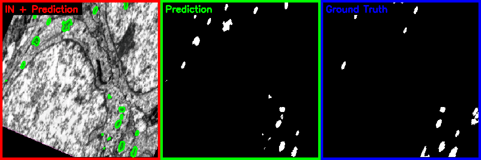
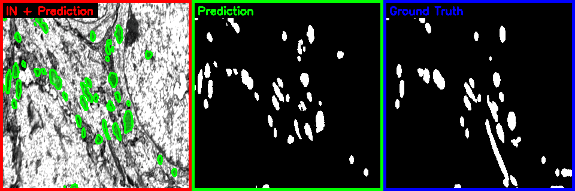
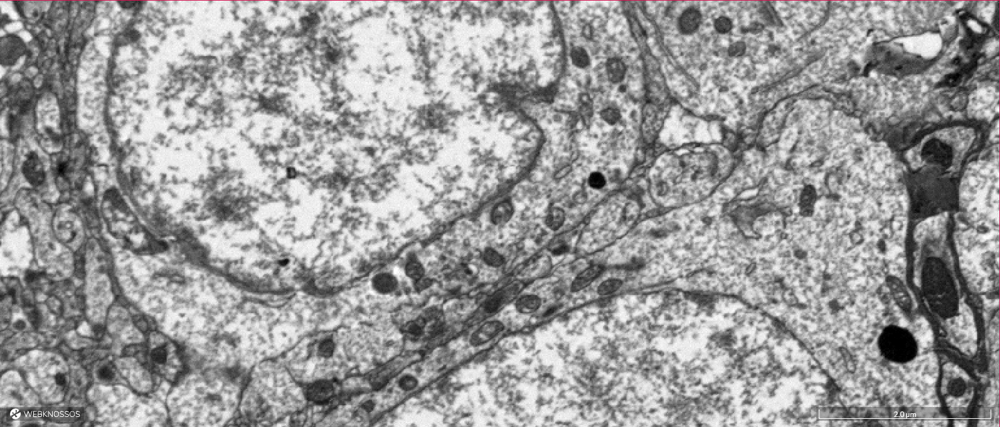
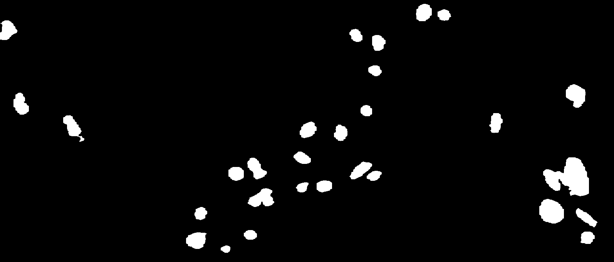

# Image Segmentation with Attention U-Net


A deep learning project for binary image segmentation with object counting. Built with PyTorch.

### AttentionUNet Architecture

<p align="center">
  
</p>


---

## Results

### Segmentation Output

Training results showing Input + Prediction overlay | Prediction mask | Ground Truth:

<p align="center">
  
</p>

<p align="center">
  
</p>

### Object Counting

**Input Image:**

<p align="center">
  
</p>

**Output with Count (29 objects detected):**

<p align="center">
  
</p>

**Binary Mask:**

<p align="center">
  
</p>


---

## Features

- **AttentionUNet** - Custom model with CBAM attention and learnable downsampling (no MaxPool!)
- **Patch-based inference** - Handle large images without running out of memory
- **Object counting** - Count and analyze segmented regions with bounding boxes
- **Multi-scale fusion** - Combines predictions from multiple decoder levels

---

## Quick Start

### 1. Install dependencies

```bash
pip install torch torchvision opencv-python pillow tqdm numpy
```

### 2. Prepare your data

```
YourDataset/
├── IN/          # Input images
│   ├── image1.png
│   └── ...
└── GT/          # Ground truth masks (0=background, 255=foreground)
    ├── image1.png
    └── ...
```

### 3. Train

```bash
python train.py --data_dir YourDataset --model attention_unet --epochs 100
```

### 4. Run inference with counting

```bash
python inference.py --image test.jpg --checkpoint checkpoints_small/best_model.pth --count --overlay --show_bbox
```

---

## Training

**Basic:**
```bash
python train.py --data_dir YourDataset --epochs 100
```

**Full options:**
```bash
python train.py \
    --data_dir YourDataset \
    --model attention_unet \
    --epochs 150 \
    --batch_size 4 \
    --lr 5e-4 \
    --image_size 320 \
    --save_every 2 \
    --device cuda
```

**Resume training:**
```bash
python train.py --data_dir YourDataset --resume checkpoints_small/best_model.pth
```

**Output:**
- `checkpoints_small/best_model.pth` - Best model
- `train_results/epoch_XX/` - Sample predictions every N epochs

---

## Inference

### Basic
```bash
# Single image
python inference.py --image photo.jpg --checkpoint model.pth

# With overlay
python inference.py --image photo.jpg --checkpoint model.pth --overlay

# Batch processing
python inference.py --image_dir ./photos --checkpoint model.pth
```

### Large Images (Patch-based)
```bash
python inference.py \
    --image huge_image.tif \
    --checkpoint model.pth \
    --patch_size 512 \
    --overlap 64
```

### Object Counting
```bash
# Basic counting
python inference.py --image photo.jpg --checkpoint model.pth --count

# With visualization
python inference.py --image photo.jpg --checkpoint model.pth \
    --count --overlay --show_bbox --show_id

# Filter by object size
python inference.py --image photo.jpg --checkpoint model.pth \
    --count --min_area 100 --max_area 5000
```

**Output files:**
- `output/image_mask.png` - Binary segmentation mask
- `output/image_overlay.png` - Visualization with bounding boxes
- `output/counts.json` - Detailed object information

**JSON output example:**
```json
{
  "summary": {
    "total_images": 56,
    "total_objects": 1800
  },
  "images": {
    "image.png": {
      "count": 29,
      "total_area": 42317,
      "coverage": 3.9,
      "objects": [
        {"id": 1, "area": 7234, "centroid": [1479, 461], "bbox": [1410, 409, 119, 101]},
        {"id": 2, "area": 3187, "centroid": [1430, 549], "bbox": [1400, 517, 64, 64]}
      ]
    }
  }
}
```

---

## Models

| Model | Parameters | Description |
|-------|------------|-------------|
| `attention_unet` | 6.5M | **Recommended.** CBAM attention + learnable downsampling |
| `u2net_small` | 1.1M | Lightweight, uses MaxPool |
| `u2net` | 44M | Full U²-Net |


**Key features:**
- **Learnable Downsampling**: Strided convolutions instead of MaxPool
- **CBAM Attention**: Channel + Spatial attention at every block
- **Attention-gated Skip Connections**: Focus on relevant features
- **Multi-scale Fusion**: Weighted combination of decoder outputs

---

## Project Structure

```
segmention/
├── train.py              # Training script
├── inference.py          # Inference + counting
├── model/
│   └── u2net.py          # Model architectures
├── data/
│   └── dataset.py        # Data loading + augmentation
├── images/               # README images
├── checkpoints_small/    # Saved models
├── train_results/        # Training visualizations
└── output/               # Inference results
```

---

## Tips

**Training:**
- Start with `attention_unet` - works well for most cases
- Use `--save_every 2` to monitor progress
- Lower learning rate if loss plateaus

**Inference:**
- For images > 2000px, use `--patch_size 512`
- Adjust `--threshold` (default 0.5) for thicker/thinner masks
- Use `--min_area` to filter noise when counting

**Data:**
- More training data = better results
- Augmentation enabled by default (flip, rotate, color jitter)
- Ground truth should be clean binary masks

---

## Requirements

- Python 3.8+
- PyTorch 1.9+
- OpenCV
- PIL
- tqdm
- NumPy

```bash
pip install -r requirements.txt
```

---

## License

MIT
